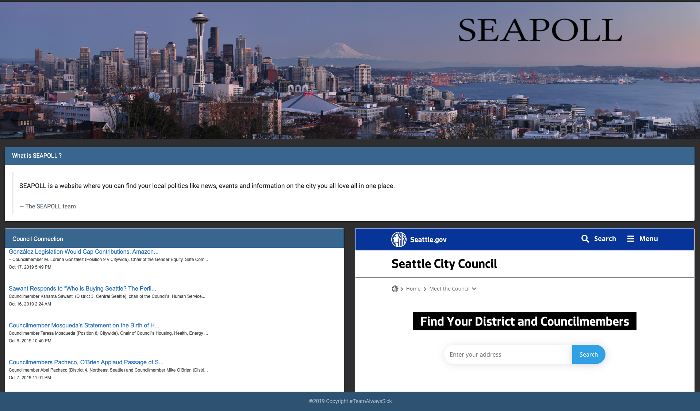
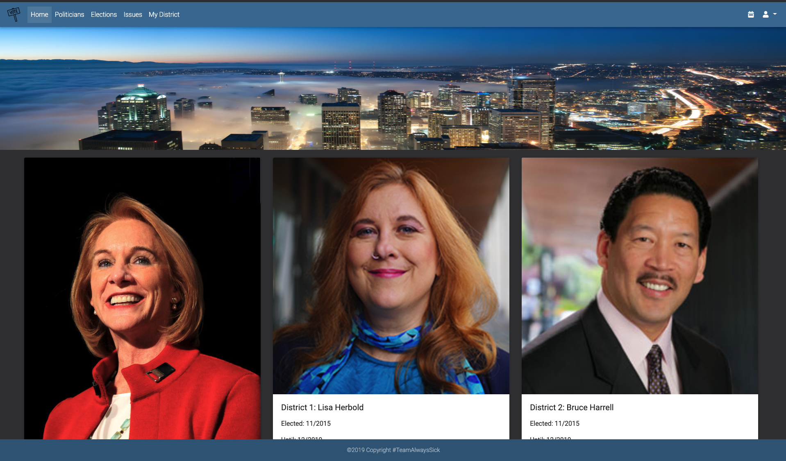
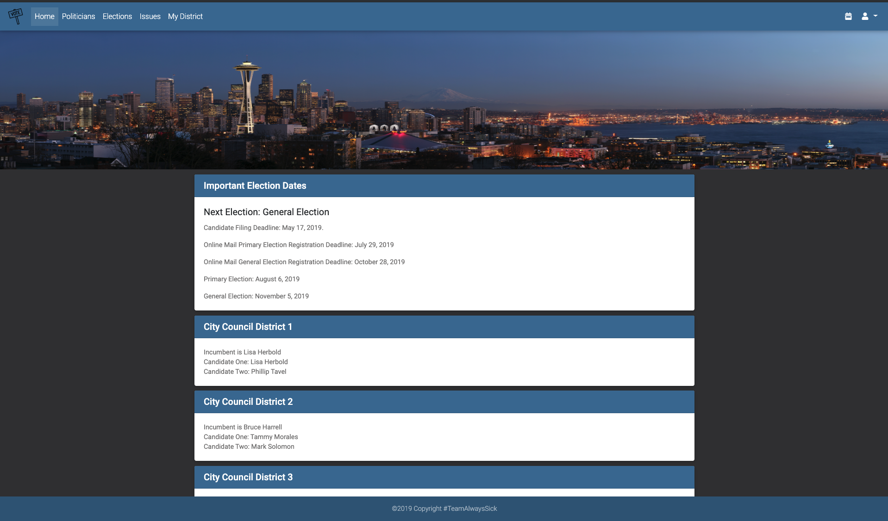
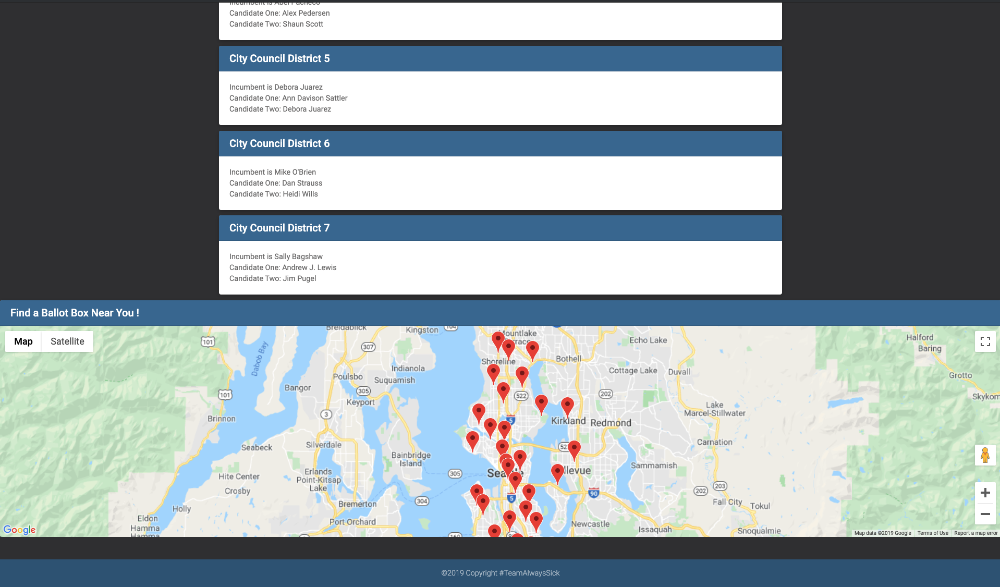
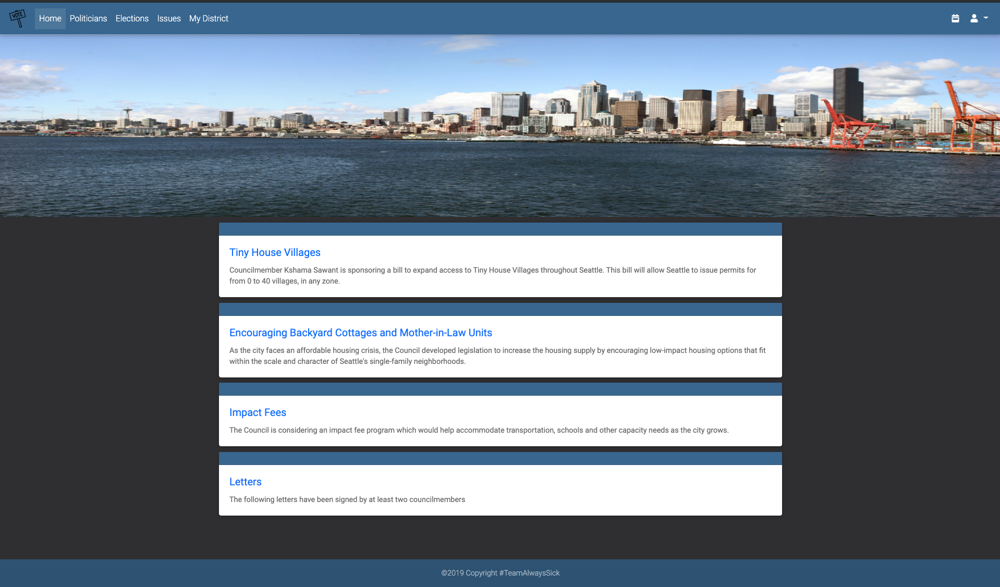
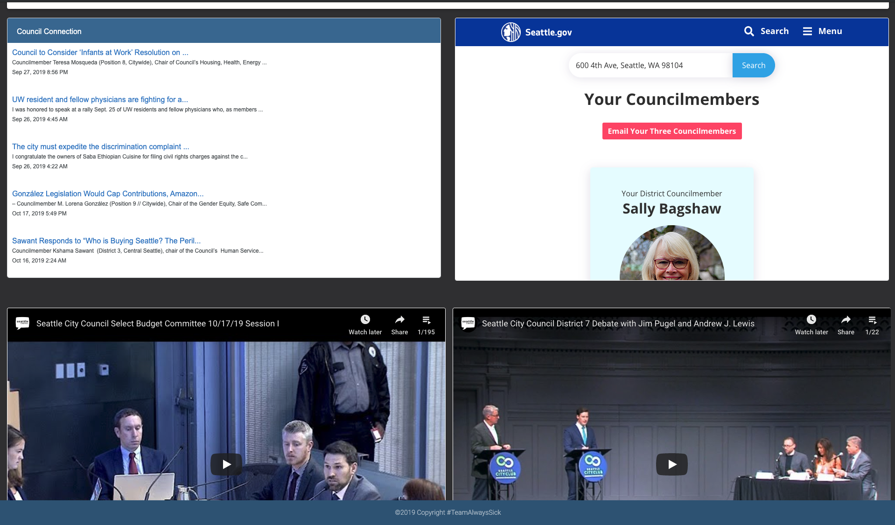
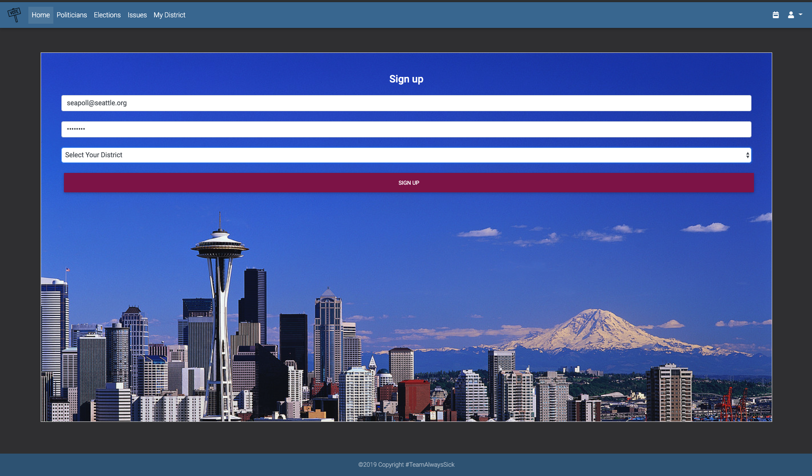

# SEAPOLL

# Summary
Life is complicated; understanding local politics should not be. With so many different sources providing information, it can be overwhelming to try and find unbiased content. This is a major deterrent to having well-informed, involved citizens. 

SeaPoll is a centralized, informative, data-driven website that compiles unbiased political (local and national) information from a variety of sources in a digestible and user-friendly format. Information regarding local and regional politicians, policies, upcoming forums, and elections are available with two viewing options: visitor or a customizable user profile.

# Installation
> Clone the repository to you local machine using the command line

> Install required npm packages

> Configure and initialize node server

## Deployed Link
> https://seapoll.herokuapp.com/

 
 The home page  upon opening the webpage 

 Click on the Politician tab and the user is redirected to a page that contains the information on elected city counsel members: 
 
 The election page contains information regarding incumbents and candidates for each district as well as a map of the 24 hour drop boxes: 
 
 
 Issues page: 
 
 Search for counsel members by user address: 

 Sign up form to create custom profile: 
 
 #

<!-- make this into the fancy little button links -->
# Technologies Used
- JavaScript
- Handlebars
- Bootstrap
- HTML
- CSS 

## NPM packages
- Cheerio
- Express
- Axios
- Async
- Sequelize